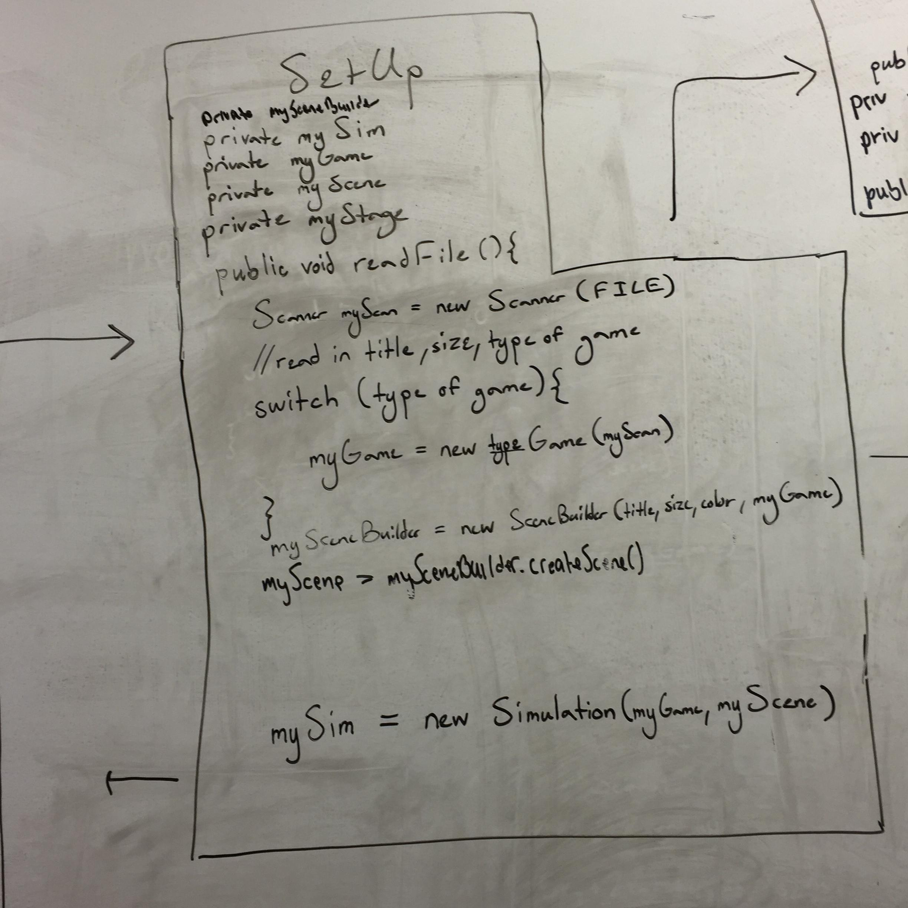

**Introduction**

This program is meant to process input from an XML file and then successfully animate 2D grid cell automata simulations. To efficiently animate different simulations and leave space for future implementations, we intend to design our program to be as flexible as possible with limited dependencies. In particular, we have split our program into meaningful classes that allow for the easy flow of objects and data. We utilize superclasses and subclasses to minimize duplicated code, allowing our program to remain efficient and readable. The primary architecture of our program allows for the open extension of new simulation and cell types while mostly closing off access to inner method and classes.

**Overview**

Our program will be split into 6 primary classes that are related as follows:

Main will be a simple class that merely creates the stage and then launches the program.

Setup will contain the major initializations of the program by reading in the file and calling all necessary methods from three other major classes: Game, Simulation, and SceneBuilder. This is shown below:

Game will be a superclass that contains the logic of our games. Each individual simulation will have a class that extends game in order to utilize the similar methods that are necessary to handle cell updating and simulation logic. The exact details are as described in the following picture:

The gameLogic method within Game will serve to manipulate our Cell class. This class, which extends Rectangle, will have all the pertinent information regarding cells stored, including cells’ direct neighbors. The exact variables and methods are described as follows:

SceneBuilder will be a simple class that creates the scene and initializes the necessary objects to be displayed in our window. We will have the necessary methods and variables to efficiently implement this as shown in the following picture:

Finally, simulation will contain all of the necessary methods to update our simulations frame by frame. We will have the step method here that updates the cells on the grid according to the rules of the specific game, as shown in the following picture:

**User Interface**

The image above depicts the planned user interface (UI). Overall, the UI is quite simple; it consists of a large window on the top that displays the cell animation and a smaller section on the bottom with buttons that allow the user to manipulate the simulation. At the very top of the window, above the cell simulation, the simulation title and author will be displayed. Moving on, the play/pause button simply stops the simulation whilst running and restarts it if clicked again. The step button allows the user to ‘step’ through the program frame by frame. The speed up and slow down buttons adjust the speed of the simulation by a factor of two in their respective directions. The load file button will engender a pop-up window where the user can insert the name of a new file. If the user enters a new file and clicks the enter key, the program will restart running a new simulation based off the new file. All the buttons can be activated by hovering over them and then clicking with the mouse.

As far as erroneous situations that should be reported to the user, our program will display such errors in place of the cell simulation. The errors we are planning to account for and report out are if input data is bad (unreadable), an empty file is submitted, or if a file asks for a simulation that our program does not handle.

**Design Detail**

Each component described in the overview is fleshed out by the images following the description. Each class will complete a function as stated in the specification as follows: 

Our main class will contain a single method that launches the game and initializes the stage. We chose to keep the main class short because we wanted to group classes by purpose and function, and we felt like starting the application is a large enough purpose to keep it as a distinct class. 

Setup will read in the title and type of the simulation from the provided XML file using a XML parser and pass that to the certain Game subclass to handle grid initialization. Setup will initialize all the relevant classes, such as the SceneBuilder, Game, and Simulator and assigning them the relevant values, to begin initial steps for the program. It will also initialize the Scene, but then pass it to SceneBuilder. We chose to include this class in our program because we felt for ease of communication between the classes and necessary values, that we should include them all in a single class. While this class does have a lot of dependencies, it reduces the dependencies that other classes would suffer if we had separated initializations. This class will also be responsible for the re-initialization of the simulation if the user chooses to switch simulations using the GUI (the simulation class will call a method in this class that will reinitialize the Game to the newly selected option). This class is reading in the first segment of the XML file because it will allow us to know what game to initialize. But, we chose to pass the rest of the data along to the Game classes because they will be responsible for the grid configurations. 

The Game class will be a superclass that will be extended to create one class per type of simulation (segregation, predator-prey, fire, and game of life). Game contains all the essential methods needed to create a functional simulation with our software. This, in return, allows for easier extension of different types of games with different rules. If someone wanted to add a new game, they would only have to follow our template for the game to be cohesive. Game will contain one instance variables: myGrid. There will be a function that is public and will return the Grid as many other classes will need to access it. The Game subclasses will then configure the grid and cells as the passed XML parser instructs it to do. We will first initialize cells at a basic state, then go back and change their types according to parameters. Game subclasses will be the primary handler for how the simulation is run. They each will contain the relevant game-play rules, and will be responsible for updating the grid appropriately. We chose to do this because it allows a single class to control the major movements of the game, and allows us to only have to worry about passing the grid back and forth. Because of the superclass, there should be very little repeated code throughout the subclasses. Each subclass will essentially be movement implementation. For Catch Fire, the subclass will contain the probability for catching fire based off of what was read in. The subclasses will contain a public method that is called in the step method of the Simulation class. This public method will loop through all cells and check if it needs to be moved by examining its surrounding neighbors. If it needs to be moved, it will perform the necessary movements and move on. For instance, in the game of life, we will look at the each cell’s neighbors and determine whether or not it lives. If the cell dies, we will simply change the state of that cell to a dead cell and continue. 

The SceneBuilder class will create everything necessary in the visualization part of the specification, including displaying the 2D grid of cells, creating the buttons, assigning their actions, and displaying any text set by the resource files. For the grid, it will call the Game’s method to return the grid, then add each Cell to the Scene’s root. It will also calculate how much space is needed for the button GUI, and display the cells at a correct location and height to accompany everything. It will also dynamically calculate the size each cell needs to be based on the size of the window. At the end of this class’s function, the scene will be fully prepped and ready for simulation. We chose to make this a separate class from Setup because we think it plays a large enough role to demand its own class. Setup takes care of initializing all the back-end, while SceneBuilder initializes the front-end. 

The Simulator class will be responsible for the actual animation of the scene by creating a frame and a timeline, then moving the timeline forward. It will use step() as the method that will call on the Game to update the grid. It will also be the source of most of the key handlers for button presses as many of the buttons are related to animation progress and speed. If the Start/Stop button is pressed, we will make sure that either the timeline is paused, or the loop skips over the updateCells call. If Speed Up or Speed Down is pressed, we will change the timings of the loop. If it is paused and step is pressed, we will simply call step to make the animation move in one iteration. We decided to separate the animating methods because it contains enough back-end to warrant its own class. It also allows us to easily navigate and find the source if animation is poor. 

The Cell class will be used as a type of data structure that improves the efficiency of our code. It will extend the Shape class and will serve as the object to contain information about neighbors, and cell types. When we are deciding whether or not a cell should be moved or killed, we will look at the cell’s neighbors and determine if it should move. The Cell class can be extended to contain properties needed only for certain games. For example, in the spreading fire game, we would extend Cell upon a new FireCell class and add a new instance variable probCatch to the class so we could fully implement the rules of the game. 

Up to this point, most of the listed use cases have been mentioned but we can expand more upon them here. To apply the rules of Game of Life to a middle cell, we would simply call the updateGrid method from our GameofLife subclass. The method would contain the logic for movements in the game of life and would iterate through the ArrayList of neighbors in the Cell object in order to apply said logic. Additionally, for the case where the cell is on an edge, our program would run the exact same way. This is possible due to the logic within our updateNeighbors method within the Cell class - this method can be implemented such that either the cell has less neighbors upon reaching an edge or it accounts for neighboring cells as if the grid wrapped. Furthermore, these updates for each individual cell would be happening on a frame by frame basis since the updateGrid method will be called within the step method in the Simulator class. This is what allows for our cells to move on to the next generation and for these changes to be represented graphically (since Cell extends Shape, changing the Cell location will change the location of its image on the scene). Finally, if a user were to want to switch from a game of life simulation to a Wator version, they would click on the load file button and enter in the file that contains the initialization information for the new game. From here, the normal process upon which a game is initialized would begin as is discussed extensively above.

**Design Considerations**

One of our major design considerations was where in the program it would be appropriate to scan the XML file. For now, we decided to scan the game type, title, and author within the Setup class’ readFile method before passing the Scanner object to the Game class. Within the constructor of the Game class, the rest of the file would be scanned while simultaneously creating the Cell objects and placing them into their initial locations within the 2D array named myGrid. The first pro to this approach is that all the functions executed in the program are in classes where they seem appropriate - we thought it was more intuitive to make the grid in the Game class since that was where we would normally be updating it. Another good part of this design is that we limit duplicated code - if we were to initialize the grid within the Setup class, we would have had to write more code similar to the updateGrid method in the Game class. The downside to this approach is that it creates unneeded dependencies and creates a clunky feel in that we are scanning different parts of the file in different classes within the code. We will likely explore this issue again further into the design process.

Another issue we encountered was whether or not we should create the SceneBuilder class. The benefits to doing so are that our code is cleaner and we leave open the possibility of having different user interfaces for different simulations. The downside to creating a separate class for this function is that we create unnecessary dependencies.

**Team Responsibilities**

Advait will primarily handle all front-end development including the file scanning algorithm and the Simulation, Setup, and SceneBuilder classes. Dennis will spearhead the back-end logic, working on the subclasses for the different game implementations like Schelling’s Model of Segregation and Spreading of Fire. Henry will work on back-end design, specifically creating the Game and Cell superclasses. He will also assist Dennis by working on the logic for at least one game implementation. All team members will work together to test, debug, and refactor. Finally, these responsibilities are flexible and if one set of responsibilities are taking more time than the others, the team will adjust appropriately.

